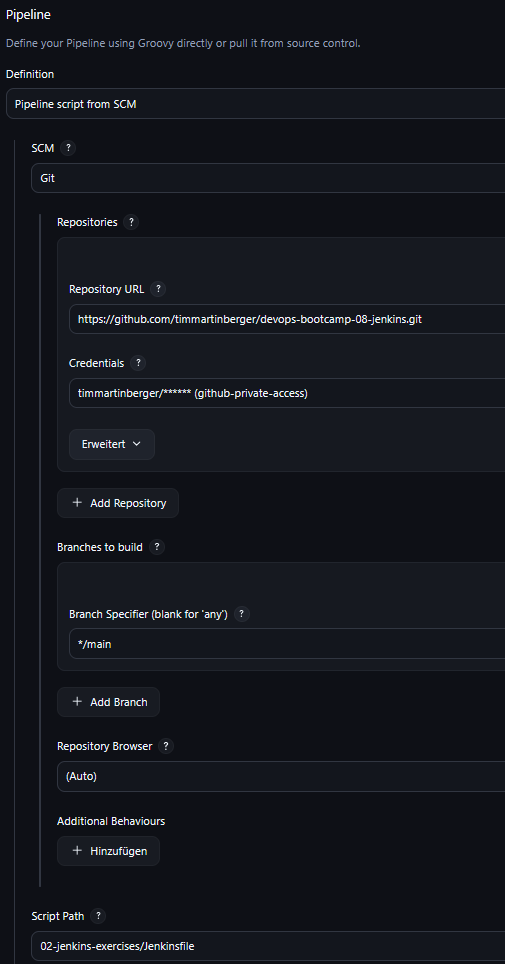

# Exercise 08

## 📖 8 - Build Automation & CI/CD with Jenkins
Your team members want to collaborate on your NodeJS application, where you list developers with their associated projects. So they ask you to set up a git repository for it.

Also, you think it's a good idea to add tests to the process, to test that no one accidentally breaks the existing code.

Moreover, you all decide every change should be immediately built and pushed to the Docker repository, so everyone can access it right away.

For that they ask you to set up a continuous integration pipeline.

### <ins>EXERCISE 1: Dockerize your Node.js App</ins>
Configure your application to be built as a Docker image.
- Dockerize your NodeJS app

### Solution 1
The resulting Dockerfile can be found [here](https://github.com/timmartinberger/devops-bootcamp-08-jenkins/tree/main/02-jenkins-exercises/Dockerfile).

### <ins>EXERCISE 2: Create a full pipeline for your Node.js App</ins>
You want the following steps to be included in your pipeline:
- Increment version

The application's version and docker image version should be incremented.

> **Tip**: Ensure to add `—no-git-tag-version` to the npm version minor command in your Jenkinsfile to avoid any commit errors

- Run tests

You want to test the code, to be sure to deploy only working code. When tests fail, the pipeline should abort.

- Build docker image with incremented version
- Push to Docker repository
- Commit to Git

The application version increment must be committed and pushed to a remote Git repository.

### Solution 2
1. To read out the version from the **_package.json_** file install the plugin **Pipeline Utility Steps**.
2. Create the [Jenkinsfile](https://github.com/timmartinberger/devops-bootcamp-08-jenkins/tree/main/02-jenkins-exercises/Jenkinsfile).
3. Create a pipeline job in the Jenkins UI. Do the following configuration:
   1. Check **Triggers → GitHub hook trigger for GITScm polling**. This enables automatic builds for every push to the GitHub repo.
   2. Set the repo to checkout from GitHub:
      

### <ins>EXERCISE 3: Manually deploy new Docker Image on server</ins>
After the pipeline has run successfully, you:
- Manually deploy the new docker image on the droplet server.

### Solution 3

### <ins>EXERCISE 4: Extract into Jenkins Shared Library</ins>
A colleague from another project tells you that they are building a similar Jenkins pipeline and they could use some of your logic. So you suggest creating a Jenkins Shared Library to make your Jenkinsfile code reusable and shareable.
Therefore, you do the following:
- Extract all logic into Jenkins-shared-library with parameters and reference it in Jenkinsfile.

### Solution 4

