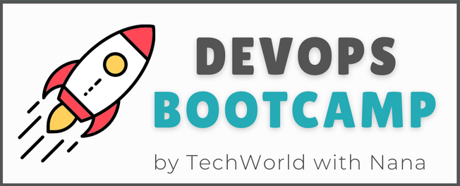

<h1>

📖 8 - Build Automation & CI/CD with Jenkins
</h1>

## 📋 Bootcamp Curriculum

<h3 align="center">DevOps Prerequisites</h3>

    1 - Introduction to DevOps (no repository) •
    2 - Operating Systems & Linux Basics (no repository) 
    3 - Version Control with Git (no repository) •
    <a href="https://github.com/timmartinberger/build-tools-exercises/tree/main">4 - Build and Package Management Tools</a>

<h3 align="center">DevOps Fundamentals</h3>

    <a href="">5 - Cloud & Infrastructure as Service</a> •
    <a href="">6 - Artifact Repository Manager with Nexus</a> •
    <a href="">7 - Containers with Docker</a>

<h3 align="center">DevOps Core</h3>

    <a href=""><b>🔖 8 - Build Automation & CI/CD with Jenkins</b></a> •
    <a href="">9 - AWS Services</a> 
    <a href="">10 - Container Orchestration with Kubernetes</a> •
    <a href="">11 - Kubernetes on AWS - EKS</a>

<h3 align="center">DevOps Advanced</h3>

    <a href="">12 - Infrastructure as Code with Terraform</a> •
    <a href="">13 - Programming Basics with Python</a> 
    <a href="">14 - Automation with Python</a> •
    <a href="">15 - Configuration Management with Ansible</a> •
    <a href="">16 - Monitoring with Prometheus</a>

---

## 🔻 Scope of this Module
- Automatize builds with the **CI/CD** tool **Jenkins** by creating multibranch pipelines, regular pipelines and freestyle jobs
  - **Build** Node.js apps using the package manager `npm` and Java apps using package manager Maven `mvn`
  - **Dockerize** the applications
  - Apply **automatic versioning** of the app and the docker image
  - **Push** builds to https://hub.docker.com
  - **Commit version** change back to the GitHub repository
- The usage of **Jenkins** contains some **administrative tasks**, like
  - Deploying Jenkins to a DigitalOcean server via Docker
  - Handle credentials with Jenkins
  - Manage plugins

 

 

### Projects
#### [01-java-maven-app](01-js-app) 
A small **Java** (Spring Boot) project that is build using `mvn` and afterward dockerized. The process was automatized using Jenkins.
Take a closer look ath the following files:
- [Jenkinsfile](https://github.com/timmartinberger/devops-bootcamp-08-jenkins/blob/main/01-java-maven-app/Jenkinsfile) (**main** branch) 
  - For a clean separation between the overall procedure and the single steps in the inner stages the code of the pipeline
    was sourced out to the **_script.groovy_** file.
  - **Pipeline Stages:** \
    Init (load groovy script) → Increment version → Test → Build jar → Build and push docker image → Deploy (dummy stage) → Commit version update 
- [Jenkinsfile](https://github.com/timmartinberger/devops-bootcamp-08-jenkins/blob/shared-lib/01-java-maven-app/Jenkinsfile) (**shared-lib** branch)
  - Here the steps were outsourced to a [**shared library**](#shared-library) which functions could potentionally be reused
    in any future pipeline.
  - **Pipeline Stages:** \
    Init (load groovy script) → Test → Build jar → Build and push docker image → Deploy (dummy stage)

#### [02-jenkins-exercises](02-jenkins-exercises)
A simple **Node.js** (JavaScript) app build with the `npm` package manager and dockerized. Also here a pipeline was used to
automatize the project. The pipeline steps were outsourcet to a [**shared library**](#shared-library).
Take a look at the [Jenkinsfile](https://github.com/timmartinberger/devops-bootcamp-08-jenkins/blob/main/02-jenkins-exercises/Jenkinsfile):
- **Pipeline Stages:** \
  Prepare Versioning → Test app → Build docker image → Commit new version to git
 

#### [Shared Library](https://github.com/timmartinberger/08-jenkins-shared-library)
Contains the code from the pipeline steps that were outsourced by the projects above. The groovy classes and pipeline logic
can be reused in future projects.

### Lecture Notes
[Click here](NOTES.md).

---

## 🌟 Acknowledgement

This repository was created as part of the TechWorldWithNana DevOps Bootcamp. 
<a href="https://www.techworld-with-nana.com/devops-bootcamp">DevOps Bootcamp</a> • <a href="https://www.youtube.com/@TechWorldwithNana"><svg fill="#c4302b" width="24px" height="24px" viewBox="0 -8 32 32" xmlns="http://www.w3.org/2000/svg"><g id="SVGRepo_bgCarrier" stroke-width="0"></g><g id="SVGRepo_tracerCarrier" stroke-linecap="round" stroke-linejoin="round"></g><g id="SVGRepo_iconCarrier"><path d="M24.325 8.309s-2.655-.334-8.357-.334c-5.517 0-8.294.334-8.294.334A2.675 2.675 0 0 0 5 10.984v10.034a2.675 2.675 0 0 0 2.674 2.676s2.582.332 8.294.332c5.709 0 8.357-.332 8.357-.332A2.673 2.673 0 0 0 27 21.018V10.982a2.673 2.673 0 0 0-2.675-2.673zM13.061 19.975V12.03L20.195 16l-7.134 3.975z"></path></g></svg> TechWorld with Nana</a>